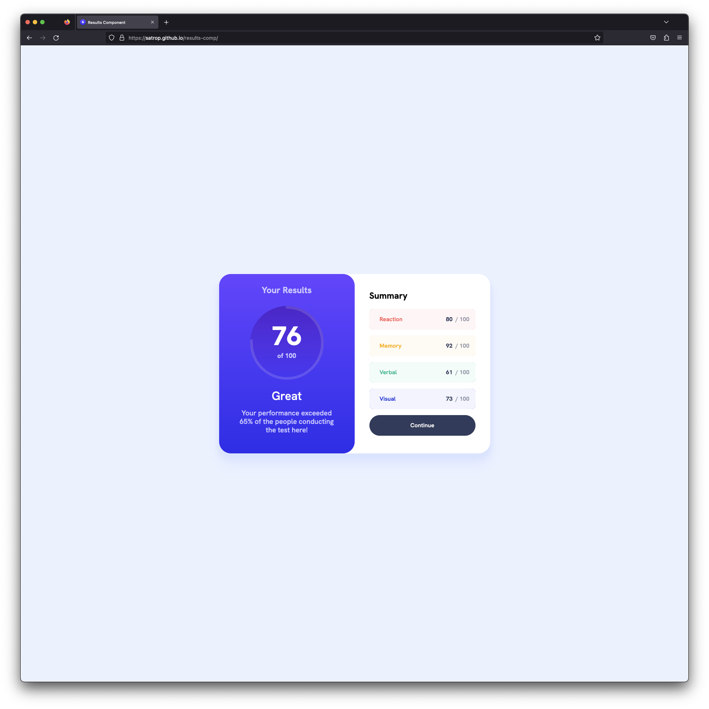

# [Frontend Mentor - Results summary component](https://www.frontendmentor.io/challenges/results-summary-component-CE_K6s0maV)

## Overview

-   [Live Site](https://satrop.github.io/results-comp/)

## My process

### Built with ❤️

-   Semantic HTML5 markup
-   SCSS with custom properties
-   Flexbox
-   CSS Grid
-   Mobile-first workflow
-   React

Fun mini project to work on unitizing Framer Motion for all the animations.

---

### 📝 Brief

Your challenge is building out this results summary component and getting it as close to the design as possible.

You can use any tools you like to help you complete the challenge. So if you've got something you'd like to practice, feel free to give it a go.

We provide the data for the results in a local data.json file. So you can use that to add the results and total score dynamically if you choose.

Your users should be able to:

-   View the optimal layout for the interface depending on their device's screen size
-   See hover and focus states for all interactive elements on the page
